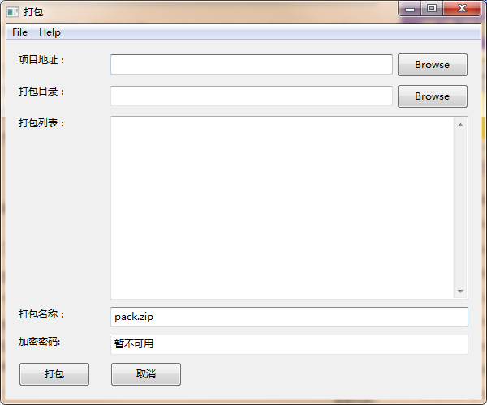

# pack-code

---

##使用说明

简单打包增量发布的源代码，说明：

1. 项目地址：项目原开发文件夹目录
2. 打包目录：文件打包到对应目录
	
3. 打包列表：需要打包的文件列表，以**项目地址**为根目录的相对地址
	
4. 打包名称：打包后压缩包的对应名称以及包类型
	
5. 打包加密密码：打包时对应包密码**暂未实现**




##依赖

```bash
#py2exe 包在pypi上未能找到
pip install http://sourceforge.net/projects/py2exe/files/latest/download?source=files
```

##关于加密
由于使用的`zipfile`模块，并不支持打包加密，暂未实现。正在想办法解决中